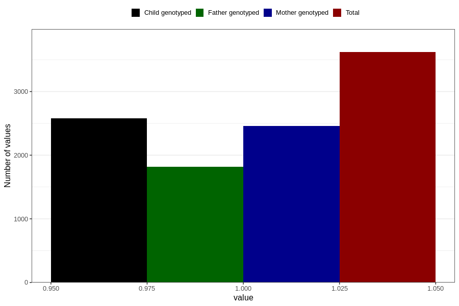

# asthma_yes_18m
Variable mapping to questionnaire: q5, question EE824.
- Number of values:

| Value | Total | Child genotyped | Mother genotyped | Father genotyped |
| ----- | ----- | --------------- | ---------------- | ---------------- |
| Missing | 110004 | 72848 | 69309 | 48401 |
| Non-missing | 3619 | 2583 | 2460 | 1817 |
| 1 | 3619 | 2583 | 2460 | 1817 |

