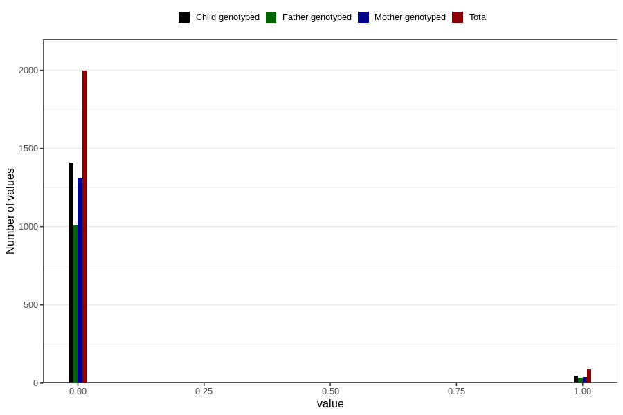

# autistic_traits_2_yes_3y
Variable mapping to questionnaire: q6, question GG583.
- Number of values:

| Value | Total | Child genotyped | Mother genotyped | Father genotyped |
| ----- | ----- | --------------- | ---------------- | ---------------- |
| Missing | 111540 | 73972 | 70421 | 49174 |
| Non-missing | 2083 | 1459 | 1348 | 1044 |
| 0 | 1997 | 1410 | 1307 | 1009 |
| 1 | 86 | 49 | 41 | 35 |

