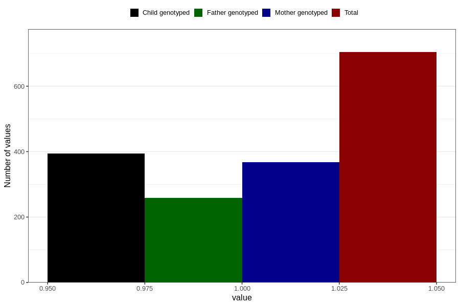

# delayed_speech_development_yes_18m
Variable mapping to questionnaire: q5, question EE840.
- Number of values:

| Value | Total | Child genotyped | Mother genotyped | Father genotyped |
| ----- | ----- | --------------- | ---------------- | ---------------- |
| Missing | 112919 | 75037 | 71401 | 49960 |
| Non-missing | 704 | 394 | 368 | 258 |
| 1 | 704 | 394 | 368 | 258 |

