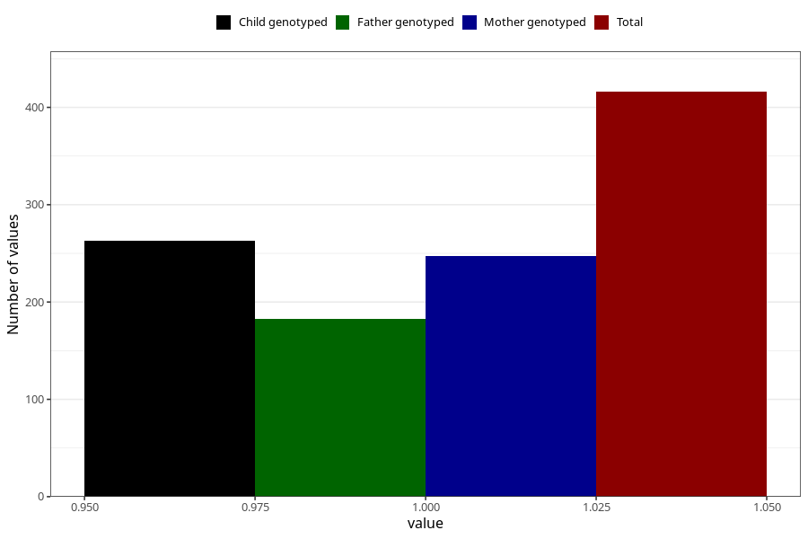

# heart_defect_previous_3y
Variable mapping to questionnaire: q6, question GG63.
- Number of values:

| Value | Total | Child genotyped | Mother genotyped | Father genotyped |
| ----- | ----- | --------------- | ---------------- | ---------------- |
| Missing | 113207 | 75168 | 71522 | 50035 |
| Non-missing | 416 | 263 | 247 | 183 |
| 1 | 416 | 263 | 247 | 183 |

