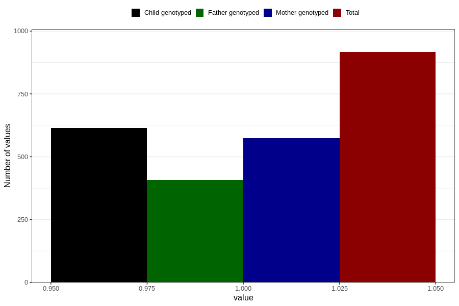

# heart_defect_previously_18m
Variable mapping to questionnaire: q5, question EE817.
- Number of values:

| Value | Total | Child genotyped | Mother genotyped | Father genotyped |
| ----- | ----- | --------------- | ---------------- | ---------------- |
| Missing | 112707 | 74817 | 71196 | 49810 |
| Non-missing | 916 | 614 | 573 | 408 |
| 1 | 916 | 614 | 573 | 408 |

