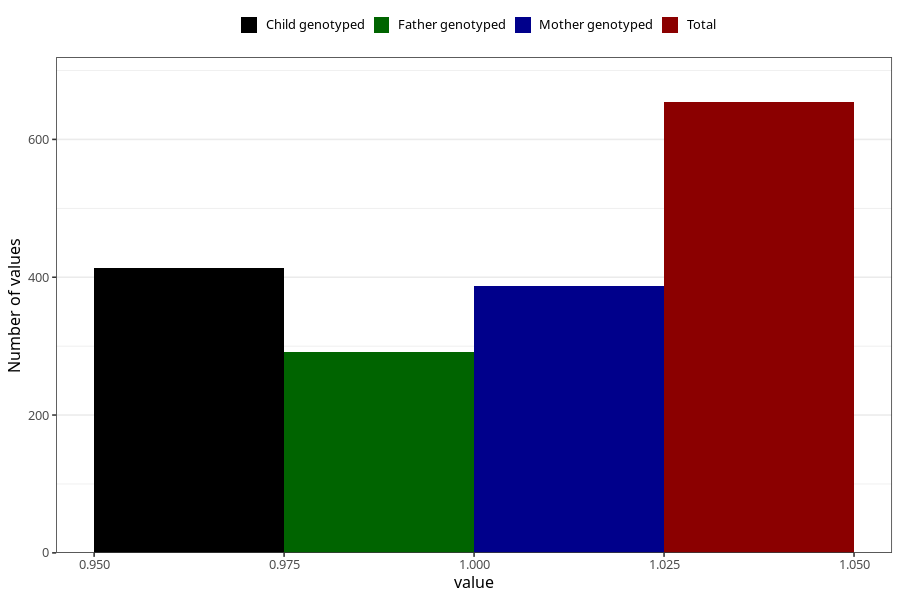

# heart_defect_yes_18m
Variable mapping to questionnaire: q5, question EE816.
- Number of values:

| Value | Total | Child genotyped | Mother genotyped | Father genotyped |
| ----- | ----- | --------------- | ---------------- | ---------------- |
| Missing | 112969 | 75018 | 71382 | 49926 |
| Non-missing | 654 | 413 | 387 | 292 |
| 1 | 654 | 413 | 387 | 292 |

