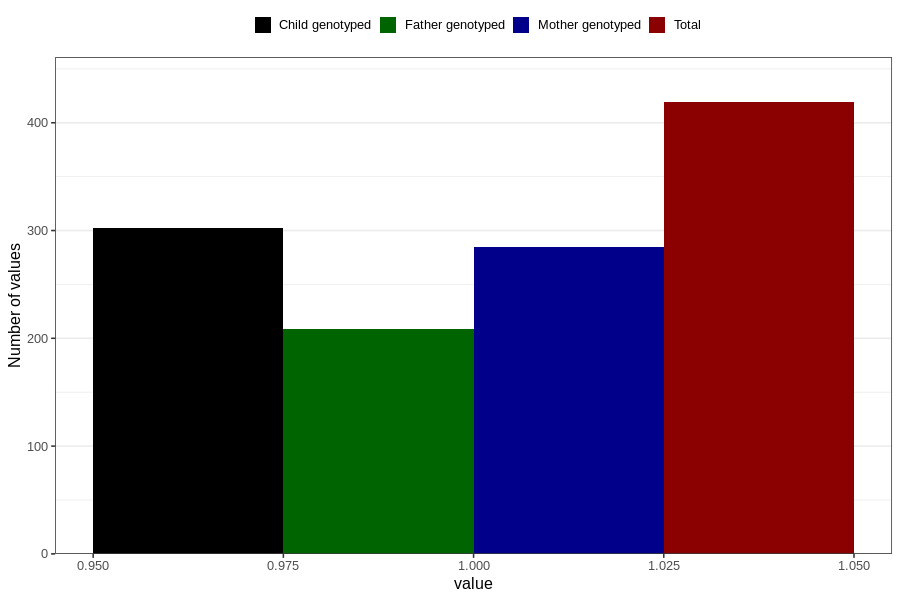

# hives_yes_18m
Variable mapping to questionnaire: q5, question EE832.
- Number of values:

| Value | Total | Child genotyped | Mother genotyped | Father genotyped |
| ----- | ----- | --------------- | ---------------- | ---------------- |
| Missing | 113204 | 75129 | 71484 | 50009 |
| Non-missing | 419 | 302 | 285 | 209 |
| 1 | 419 | 302 | 285 | 209 |

