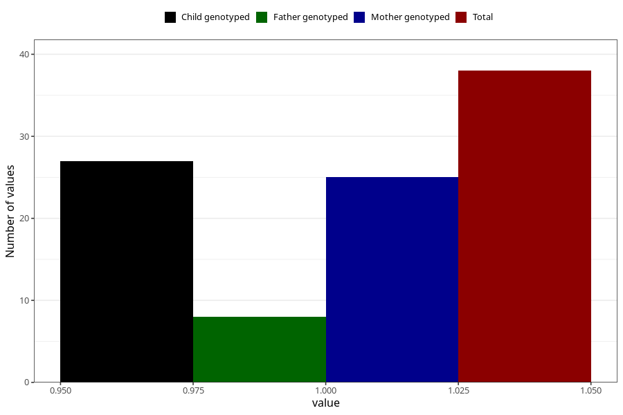

# other_gastrointestinal_problems_yes_3y
Variable mapping to questionnaire: q6, question GG90.
- Number of values:

| Value | Total | Child genotyped | Mother genotyped | Father genotyped |
| ----- | ----- | --------------- | ---------------- | ---------------- |
| Missing | 113585 | 75404 | 71744 | 50210 |
| Non-missing | 38 | 27 | 25 | 8 |
| 1 | 38 | 27 | 25 | 8 |

