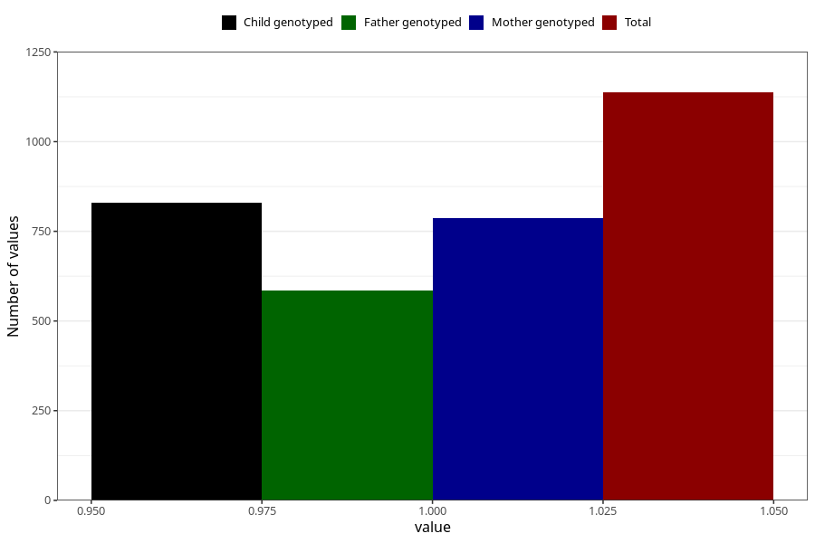

# other_longterm_illness_condition_previous_3y
Variable mapping to questionnaire: q6, question GG115.
- Number of values:

| Value | Total | Child genotyped | Mother genotyped | Father genotyped |
| ----- | ----- | --------------- | ---------------- | ---------------- |
| Missing | 112486 | 74601 | 70983 | 49633 |
| Non-missing | 1137 | 830 | 786 | 585 |
| 1 | 1137 | 830 | 786 | 585 |

