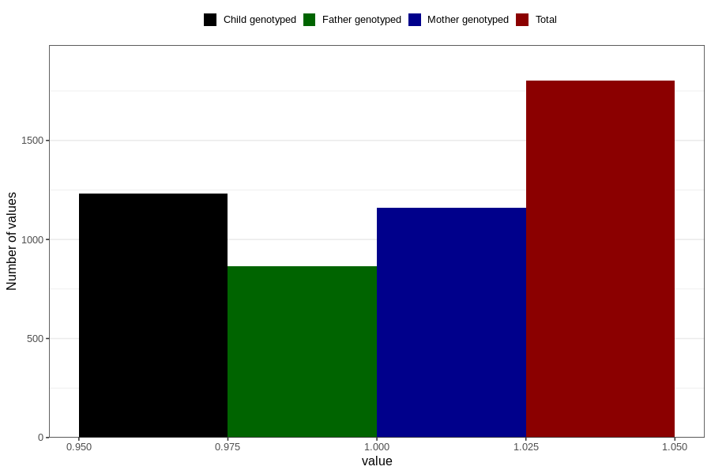

# other_longterm_illness_condition_yes_3y
Variable mapping to questionnaire: q6, question GG114.
- Number of values:

| Value | Total | Child genotyped | Mother genotyped | Father genotyped |
| ----- | ----- | --------------- | ---------------- | ---------------- |
| Missing | 111822 | 74198 | 70607 | 49352 |
| Non-missing | 1801 | 1233 | 1162 | 866 |
| 1 | 1801 | 1233 | 1162 | 866 |

