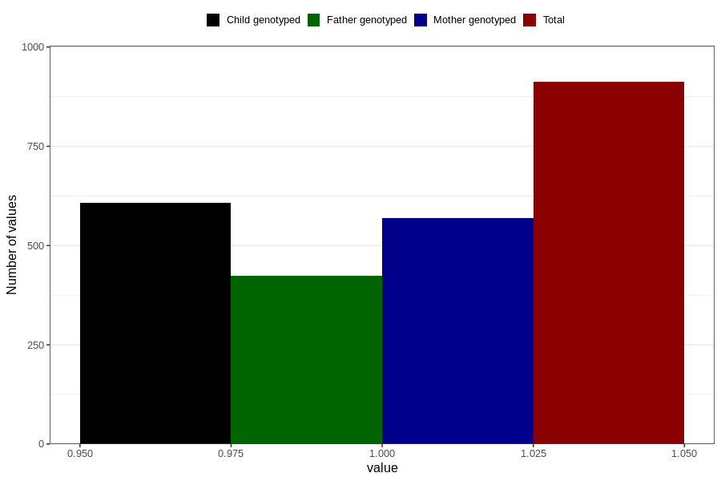

# other_malformations_yes_18m
Variable mapping to questionnaire: q5, question EE852.
- Number of values:

| Value | Total | Child genotyped | Mother genotyped | Father genotyped |
| ----- | ----- | --------------- | ---------------- | ---------------- |
| Missing | 112711 | 74823 | 71200 | 49795 |
| Non-missing | 912 | 608 | 569 | 423 |
| 1 | 912 | 608 | 569 | 423 |

