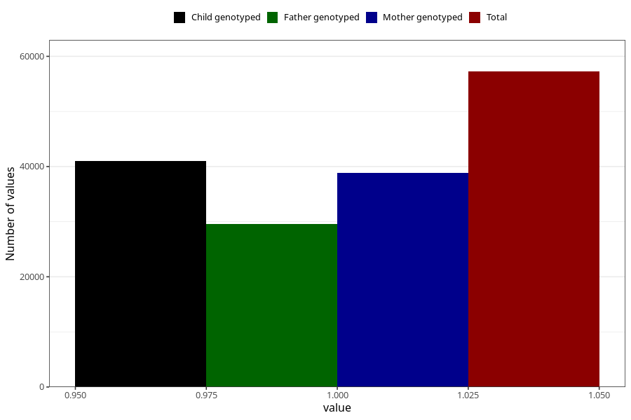

# social_problems_no_18m
Variable mapping to questionnaire: q5, question EE967.
- Number of values:

| Value | Total | Child genotyped | Mother genotyped | Father genotyped |
| ----- | ----- | --------------- | ---------------- | ---------------- |
| Missing | 56383 | 34384 | 32887 | 20646 |
| Non-missing | 57240 | 41047 | 38882 | 29572 |
| 1 | 57240 | 41047 | 38882 | 29572 |

