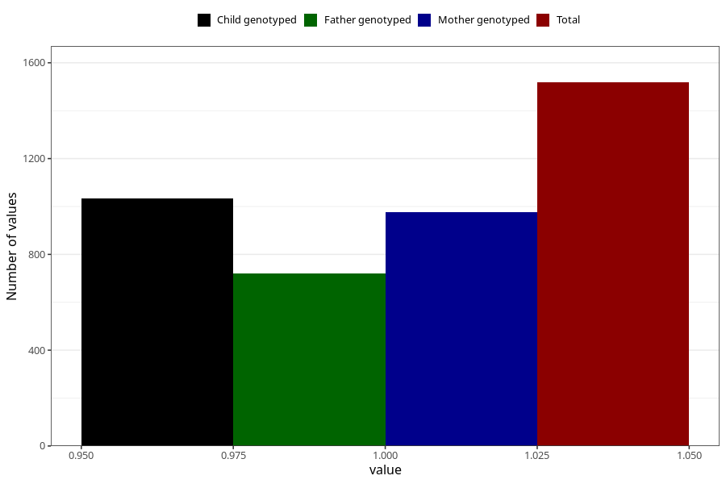

# specialist_diagnosis_2_18m
Variable mapping to questionnaire: q5, question EE862.
- Number of values:

| Value | Total | Child genotyped | Mother genotyped | Father genotyped |
| ----- | ----- | --------------- | ---------------- | ---------------- |
| Missing | 112105 | 74396 | 70793 | 49497 |
| Non-missing | 1518 | 1035 | 976 | 721 |
| 1 | 1518 | 1035 | 976 | 721 |

