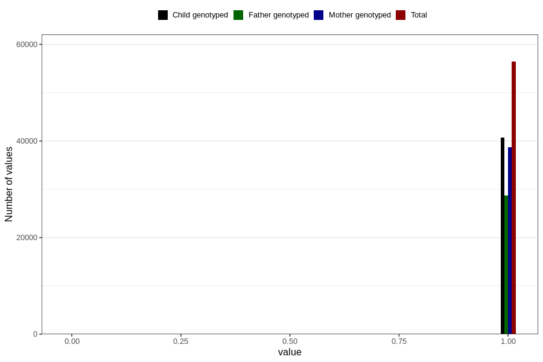

# trouble_relating_to_others_no_3y
Variable mapping to questionnaire: q6, question GG578.
- Number of values:

| Value | Total | Child genotyped | Mother genotyped | Father genotyped |
| ----- | ----- | --------------- | ---------------- | ---------------- |
| Missing | 57187 | 34651 | 33042 | 21502 |
| Non-missing | 56436 | 40780 | 38727 | 28716 |
| 0 | 27 | 18 | 17 | 12 |
| 1 | 56409 | 40762 | 38710 | 28704 |

