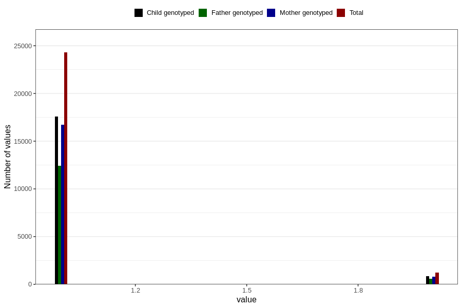

# fluoride_capsules_amount_per_time_7y
Variable mapping to questionnaire: q8, question JJ540.
- Number of values:

| Value | Total | Child genotyped | Mother genotyped | Father genotyped |
| ----- | ----- | --------------- | ---------------- | ---------------- |
| Missing | 88078 | 56968 | 54240 | 37175 |
| Non-missing | 25545 | 18463 | 17529 | 13043 |
| 3+ at a time | 34 | 17 | 14 |14 |
| More than 1 check box filled in | 5 | 5 | 4 |4 |
| 1 | 24292 | 17584 | 16707 | 12425 |
| 2 | 1214 | 857 | 804 | 600 |

