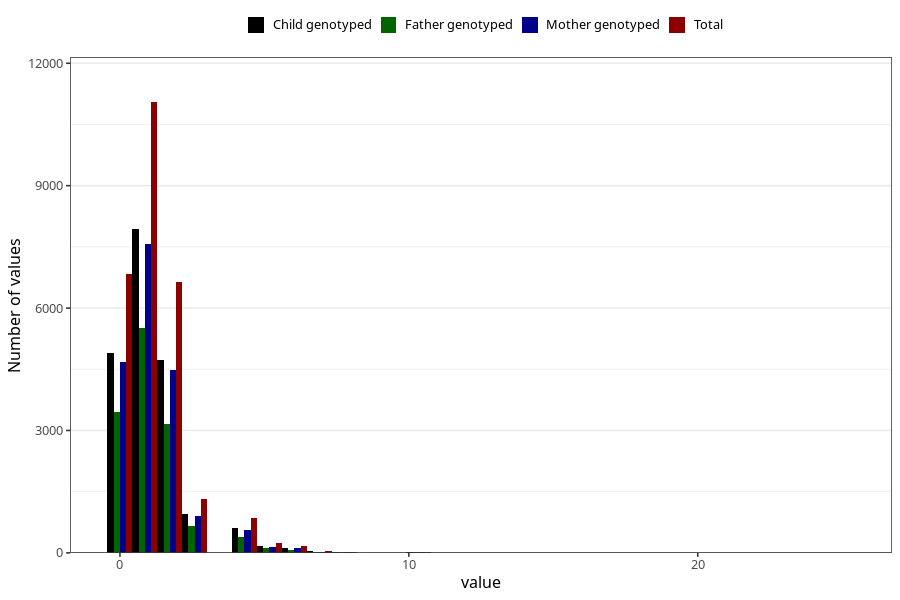

# n_slices_crisp_bread_7y
Variable mapping to questionnaire: q8, question JJ342.
- Number of values:

| Value | Total | Child genotyped | Mother genotyped | Father genotyped |
| ----- | ----- | --------------- | ---------------- | ---------------- |
| Missing | 86397 | 55949 | 53236 | 36805 |
| Non-missing | 27226 | 19482 | 18533 | 13413 |
| 0 | 6841 | 4900 | 4674 | 3463 |
| 1 | 11046 | 7942 | 7569 | 5507 |
| 2 | 6641 | 4719 | 4476 | 3161 |
| 3 | 1323 | 943 | 900 | 657 |
| 4 | 854 | 599 | 561 | 378 |
| 5 | 232 | 166 | 155 | 111 |
| 6 | 175 | 130 | 123 | 76 |
| 7 | 47 | 35 | 33 | 24 |
| 8 | 33 | 23 | 20 | 14 |
| 9 | 4 | 3 | 3 | 3 |
| 10 | 16 | 10 | 10 | 10 |
| 11 | 1 | 0 | 0 | 0 |
| 12 | 2 | 2 | 2 | 2 |
| 14 | 4 | 4 | 4 | 3 |
| 15 | 2 | 1 | 0 | 0 |
| 16 | 1 | 1 | 0 | 1 |
| 20 | 3 | 3 | 3 | 2 |
| 25 | 1 | 1 | 0 | 1 |

