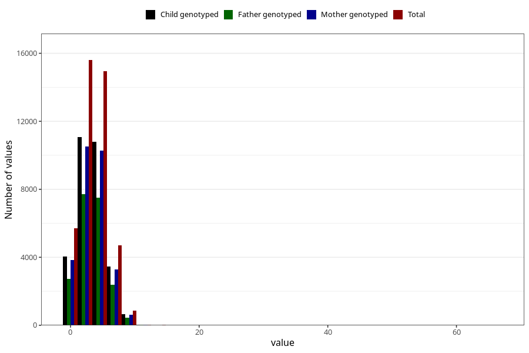

# n_slices_whole_grain_bread_7y
Variable mapping to questionnaire: q8, question JJ341.
- Number of values:

| Value | Total | Child genotyped | Mother genotyped | Father genotyped |
| ----- | ----- | --------------- | ---------------- | ---------------- |
| Missing | 71737 | 45376 | 43202 | 29392 |
| Non-missing | 41886 | 30055 | 28567 | 20826 |
| 25th percentile | 2 | 2 | 2 | 2 |
| 50th percentile | 3 | 3 | 3 | 3 |
| 75th percentile | 5 | 5 | 5 | 5 |

