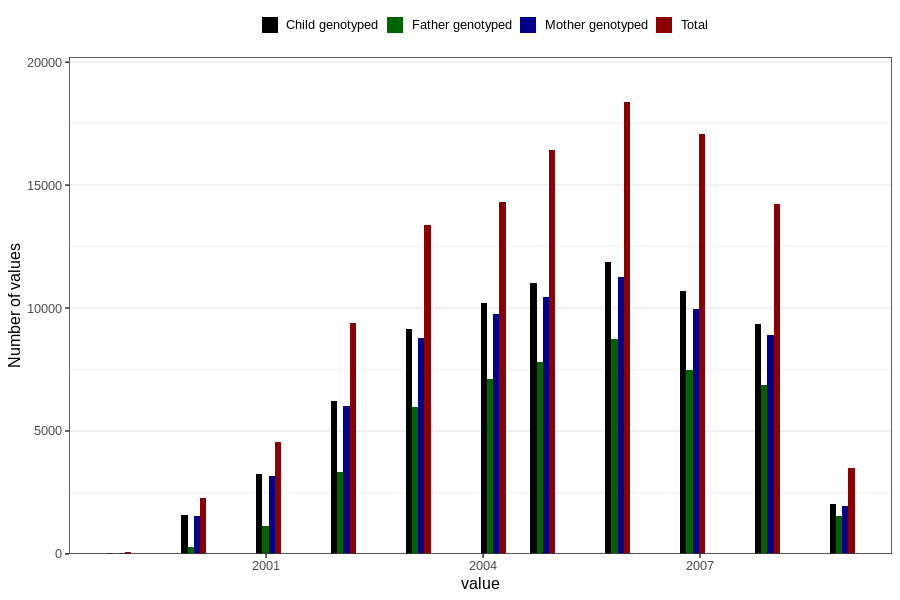

# birth_year
Variable mapping to questionnaire: mfr, question FAAR.
- Number of values:

| Value | Total | Child genotyped | Mother genotyped | Father genotyped |
| ----- | ----- | --------------- | ---------------- | ---------------- |
| Missing | 0 | 0 | 0 | 0 |
| Non-missing | 113623 | 75431 | 71769 | 50218 |
| 1999 | 60 | 28 | 26 | 6 |
| 2000 | 2284 | 1585 | 1546 | 279 |
| 2001 | 4555 | 3241 | 3152 | 1127 |
| 2002 | 9391 | 6216 | 5996 | 3336 |
| 2003 | 13386 | 9166 | 8780 | 5985 |
| 2004 | 14330 | 10203 | 9754 | 7097 |
| 2005 | 16446 | 11024 | 10443 | 7792 |
| 2006 | 18368 | 11890 | 11266 | 8729 |
| 2007 | 17078 | 10699 | 9979 | 7484 |
| 2008 | 14242 | 9337 | 8898 | 6855 |
| 2009 | 3483 | 2042 | 1929 | 1528 |

