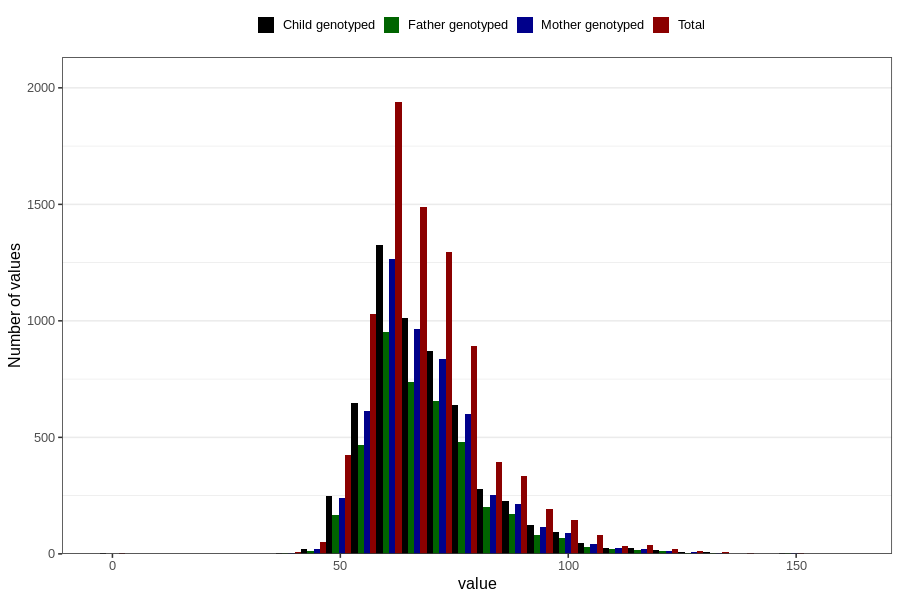

# mother_weight_before
Variable mapping to questionnaire: mfr, question MORS_VEKT_FOER.
- Number of values:

| Value | Total | Child genotyped | Mother genotyped | Father genotyped |
| ----- | ----- | --------------- | ---------------- | ---------------- |
| Missing | 105214 | 69810 | 66432 | 46125 |
| Non-missing | 8409 | 5621 | 5337 | 4093 |
| 25th percentile | 60 | 60 | 60 | 60 |
| 50th percentile | 66 | 66 | 66 | 66 |
| 75th percentile | 75 | 75 | 75 | 75 |

