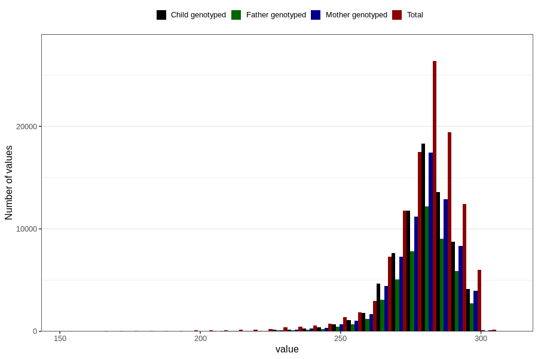

# pregnancy_duration_ultrasound
Variable mapping to questionnaire: mfr, question SVLEN_UL_DG.
- Number of values:

| Value | Total | Child genotyped | Mother genotyped | Father genotyped |
| ----- | ----- | --------------- | ---------------- | ---------------- |
| Missing | 2996 | 1645 | 1575 | 1080 |
| Non-missing | 110627 | 73786 | 70194 | 49138 |
| 25th percentile | 273 | 274 | 274 | 274 |
| 50th percentile | 281 | 281 | 281 | 281 |
| 75th percentile | 287 | 287 | 287 | 287 |

