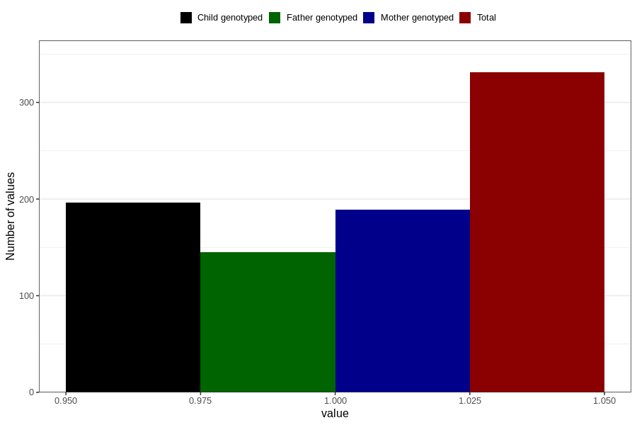

# diabetes_insulin_during
Variable mapping to questionnaire: q1m, question AA510.
- Number of values:

| Value | Total | Child genotyped | Mother genotyped | Father genotyped |
| ----- | ----- | --------------- | ---------------- | ---------------- |
| Missing | 113292 | 75235 | 71580 | 50073 |
| Non-missing | 331 | 196 | 189 | 145 |
| 1 | 331 | 196 | 189 | 145 |

