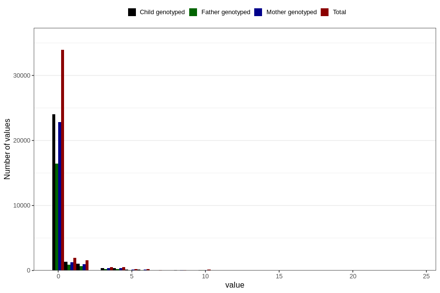

# coffee_before_boiled
Variable mapping to questionnaire: q1m, question AA1383.
- Number of values:

| Value | Total | Child genotyped | Mother genotyped | Father genotyped |
| ----- | ----- | --------------- | ---------------- | ---------------- |
| Missing | 74472 | 47978 | 45635 | 31469 |
| Non-missing | 39151 | 27453 | 26134 | 18749 |
| Consumption have been reported by a mark but no amount given | 3 | 0 | 0 |0 |
| 0 | 33923 | 23997 | 22848 | 16472 |
| 1 | 1941 | 1307 | 1244 | 875 |
| 2 | 1556 | 1017 | 972 | 699 |
| 3 | 523 | 351 | 340 | 228 |
| 4 | 542 | 353 | 333 | 222 |
| 5 | 192 | 122 | 111 | 67 |
| 6 | 215 | 149 | 139 | 100 |
| 7 | 35 | 27 | 25 | 17 |
| 8 | 77 | 42 | 39 | 22 |
| 9 | 3 | 2 | 2 | 1 |
| 10 | 107 | 59 | 56 | 32 |
| 12 | 20 | 15 | 14 | 9 |
| 14 | 3 | 2 | 1 | 0 |
| 15 | 4 | 3 | 3 | 1 |
| 16 | 1 | 1 | 1 | 1 |
| 20 | 5 | 5 | 5 | 2 |
| 24 | 1 | 1 | 1 | 1 |

