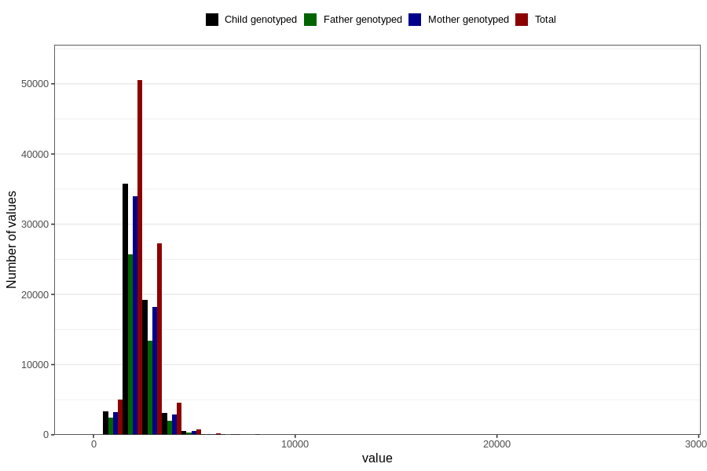

# food_kcal_day
Variable mapping to questionnaire: q2_caffeine_supplements, question f_kcal.
- Number of values:

| Value | Total | Child genotyped | Mother genotyped | Father genotyped |
| ----- | ----- | --------------- | ---------------- | ---------------- |
| Missing | 24927 | 13198 | 12674 | 6238 |
| Non-missing | 88696 | 62233 | 59095 | 43980 |
| 25th percentile | 1876.63 | 1878.59 | 1878.06 | 1870.26 |
| 50th percentile | 2230.825 | 2229.15 | 2227.99 | 2215.45 |
| 75th percentile | 2664.465 | 2653.02 | 2652.195 | 2635.1675 |

