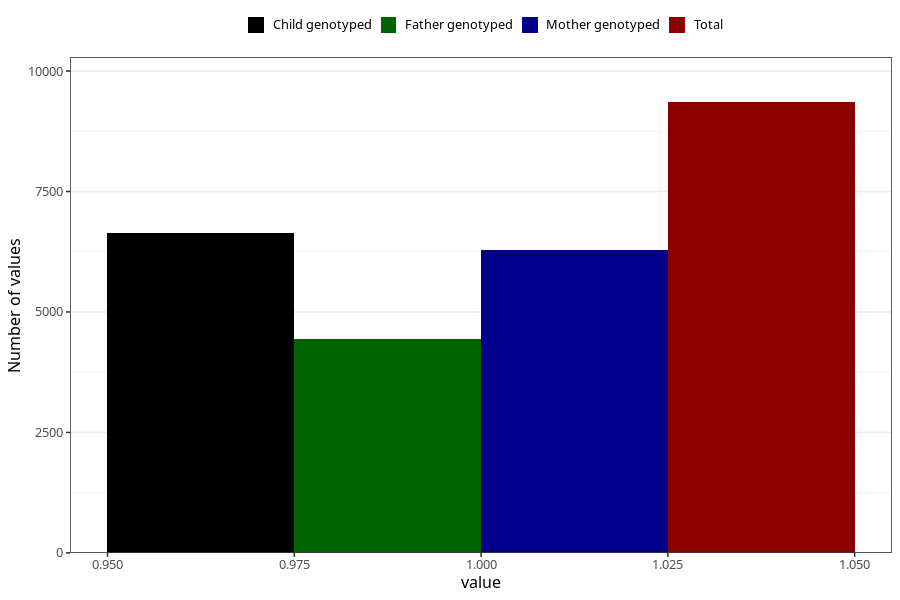

# back_pain_13w_16w
Variable mapping to questionnaire: q3, question CC352.
- Number of values:

| Value | Total | Child genotyped | Mother genotyped | Father genotyped |
| ----- | ----- | --------------- | ---------------- | ---------------- |
| Missing | 104269 | 68801 | 65486 | 45772 |
| Non-missing | 9354 | 6630 | 6283 | 4446 |
| 1 | 9354 | 6630 | 6283 | 4446 |

