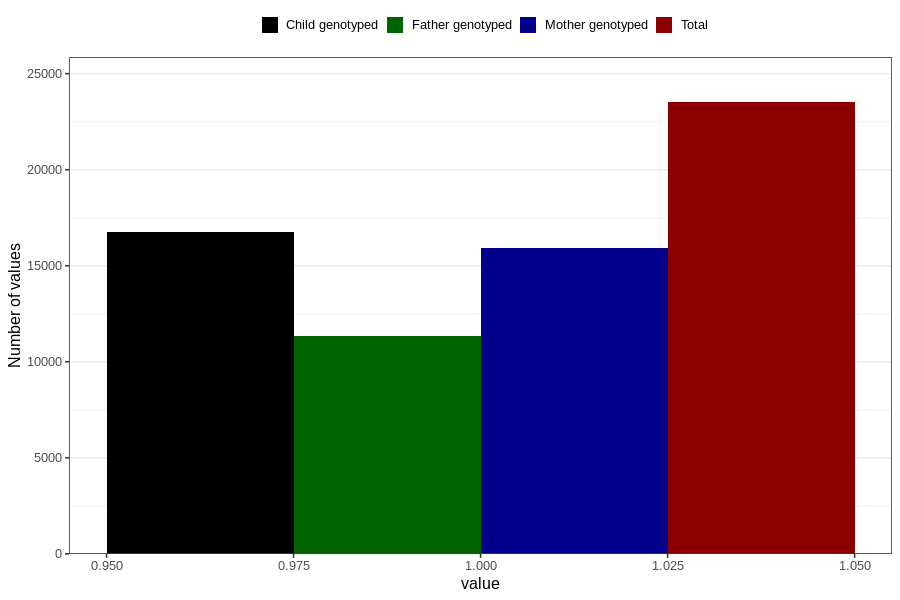

# back_pain_21w_24w
Variable mapping to questionnaire: q3, question CC354.
- Number of values:

| Value | Total | Child genotyped | Mother genotyped | Father genotyped |
| ----- | ----- | --------------- | ---------------- | ---------------- |
| Missing | 90114 | 58661 | 55851 | 38877 |
| Non-missing | 23509 | 16770 | 15918 | 11341 |
| 1 | 23509 | 16770 | 15918 | 11341 |

