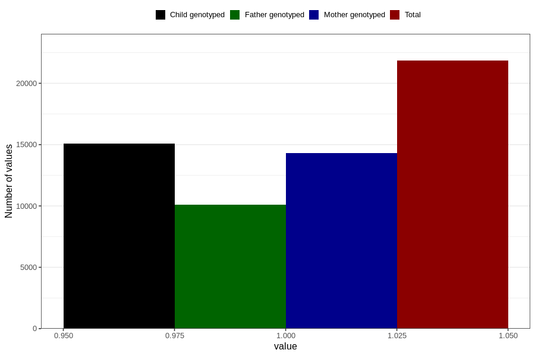

# constipation_13w_15w
Variable mapping to questionnaire: q1m, question AA269.
- Number of values:

| Value | Total | Child genotyped | Mother genotyped | Father genotyped |
| ----- | ----- | --------------- | ---------------- | ---------------- |
| Missing | 91781 | 60363 | 57469 | 40106 |
| Non-missing | 21842 | 15068 | 14300 | 10112 |
| 1 | 21842 | 15068 | 14300 | 10112 |

