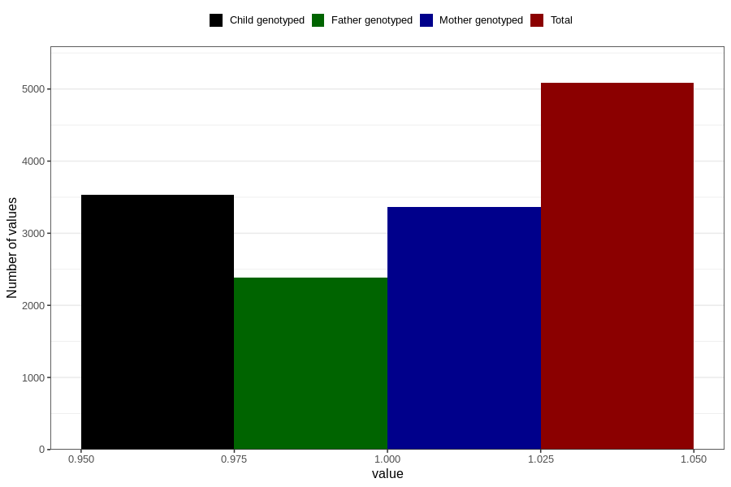

# diarrhoea_13w_15w
Variable mapping to questionnaire: q1m, question AA279.
- Number of values:

| Value | Total | Child genotyped | Mother genotyped | Father genotyped |
| ----- | ----- | --------------- | ---------------- | ---------------- |
| Missing | 108540 | 71895 | 68406 | 47828 |
| Non-missing | 5083 | 3536 | 3363 | 2390 |
| 1 | 5083 | 3536 | 3363 | 2390 |

