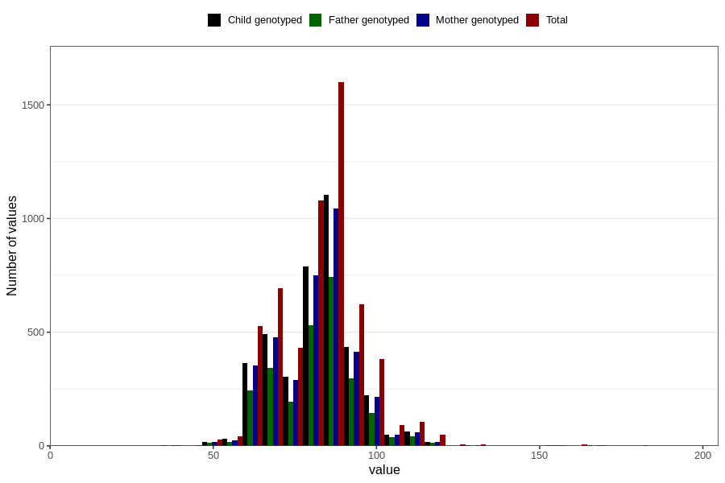

# highest_blood_pressure_during_pregnancy_30w_diastolic
Variable mapping to questionnaire: q3, question CC115.
- Number of values:

| Value | Total | Child genotyped | Mother genotyped | Father genotyped |
| ----- | ----- | --------------- | ---------------- | ---------------- |
| Missing | 107937 | 71525 | 68039 | 47593 |
| Non-missing | 5686 | 3906 | 3730 | 2625 |
| 25th percentile | 75 | 75 | 75 | 74 |
| 50th percentile | 84 | 82 | 82 | 82 |
| 75th percentile | 90 | 90 | 90 | 90 |

