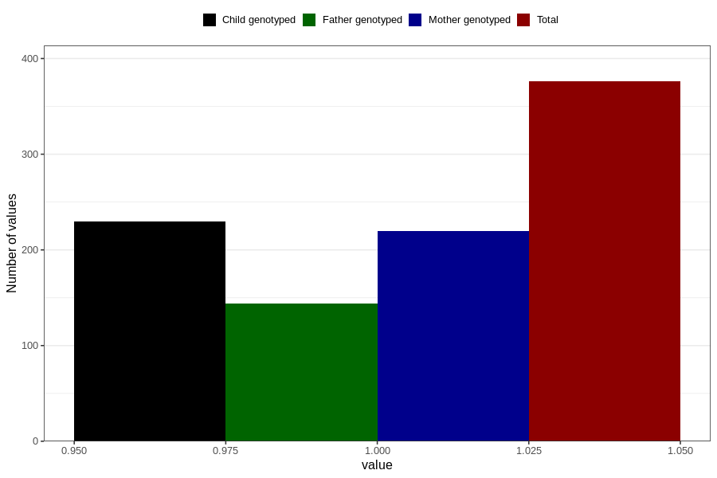

# hospitalized_threatening_preterm_labour_25_28w
Variable mapping to questionnaire: q3, question CC171.
- Number of values:

| Value | Total | Child genotyped | Mother genotyped | Father genotyped |
| ----- | ----- | --------------- | ---------------- | ---------------- |
| Missing | 113247 | 75201 | 71549 | 50074 |
| Non-missing | 376 | 230 | 220 | 144 |
| 1 | 376 | 230 | 220 | 144 |

