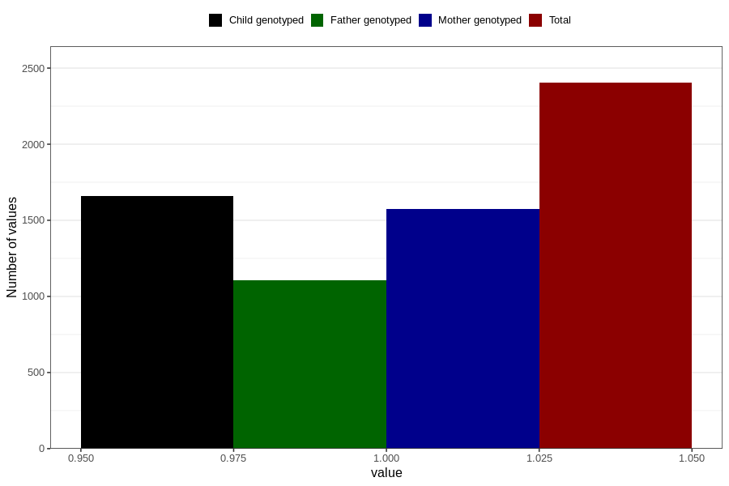

# influenza_13w_15w
Variable mapping to questionnaire: q1m, question AA379.
- Number of values:

| Value | Total | Child genotyped | Mother genotyped | Father genotyped |
| ----- | ----- | --------------- | ---------------- | ---------------- |
| Missing | 111220 | 73772 | 70195 | 49111 |
| Non-missing | 2403 | 1659 | 1574 | 1107 |
| 1 | 2403 | 1659 | 1574 | 1107 |

