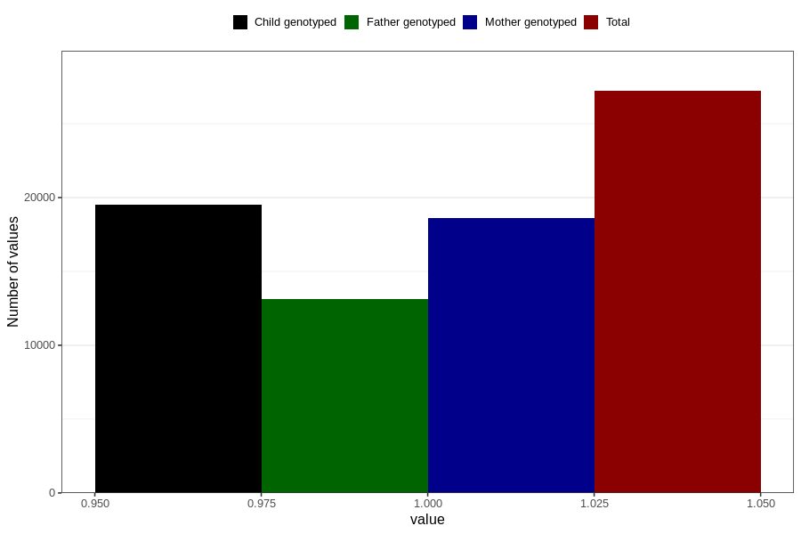

# nausea_13w_16w
Variable mapping to questionnaire: q3, question CC376.
- Number of values:

| Value | Total | Child genotyped | Mother genotyped | Father genotyped |
| ----- | ----- | --------------- | ---------------- | ---------------- |
| Missing | 86410 | 55904 | 53179 | 37085 |
| Non-missing | 27213 | 19527 | 18590 | 13133 |
| 1 | 27213 | 19527 | 18590 | 13133 |

