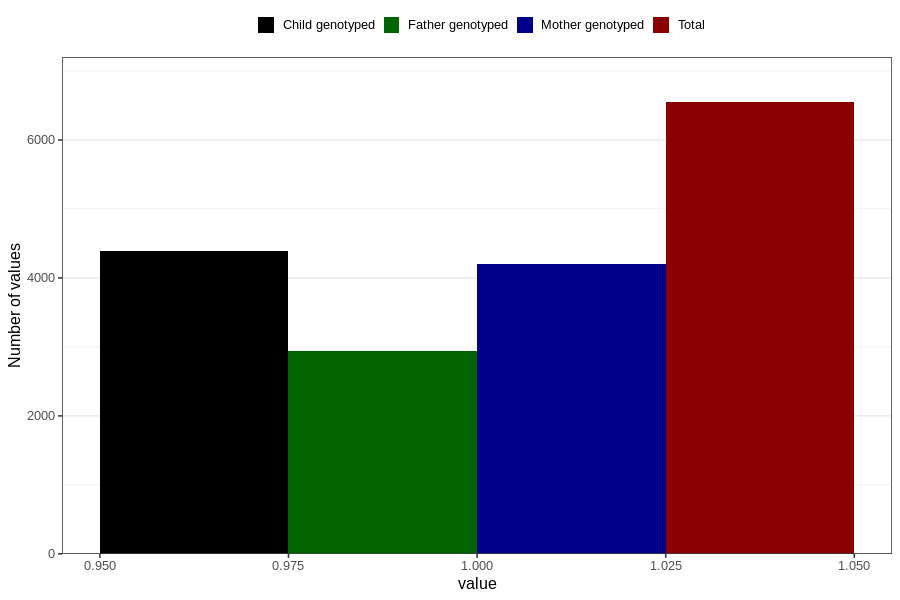

# sleeping_problems_5w_8w
Variable mapping to questionnaire: q1m, question AA297.
- Number of values:

| Value | Total | Child genotyped | Mother genotyped | Father genotyped |
| ----- | ----- | --------------- | ---------------- | ---------------- |
| Missing | 107077 | 71037 | 67573 | 47271 |
| Non-missing | 6546 | 4394 | 4196 | 2947 |
| 1 | 6546 | 4394 | 4196 | 2947 |

