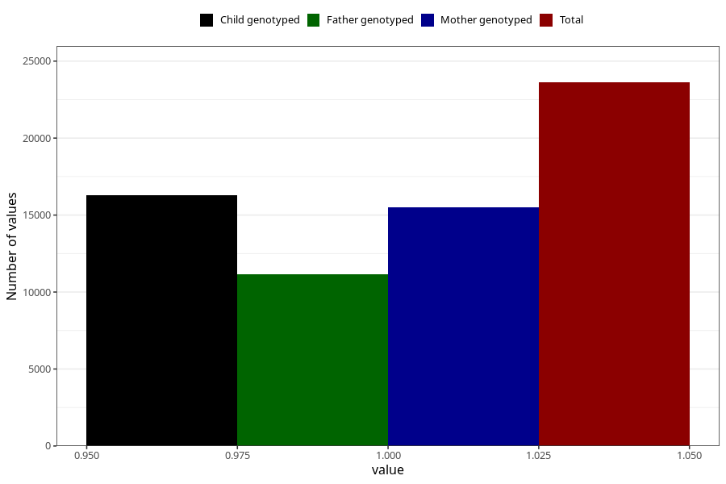

# contraception_used_condom
Variable mapping to questionnaire: q1m, question AA28.
- Number of values:

| Value | Total | Child genotyped | Mother genotyped | Father genotyped |
| ----- | ----- | --------------- | ---------------- | ---------------- |
| Missing | 90007 | 59136 | 56246 | 39038 |
| Non-missing | 23616 | 16295 | 15523 | 11180 |
| 1 | 23616 | 16295 | 15523 | 11180 |

