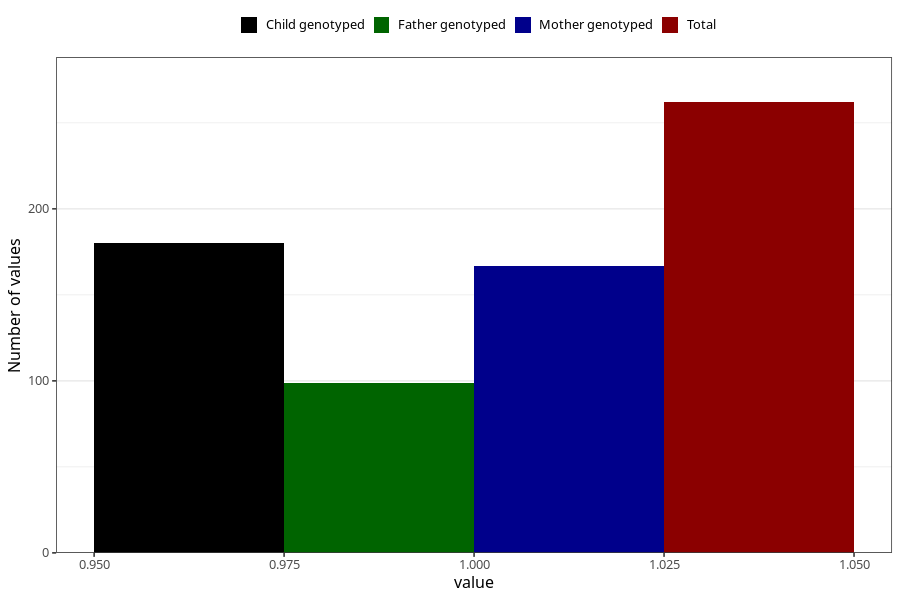

# contraception_used_diaphragm
Variable mapping to questionnaire: q1m, question AA29.
- Number of values:

| Value | Total | Child genotyped | Mother genotyped | Father genotyped |
| ----- | ----- | --------------- | ---------------- | ---------------- |
| Missing | 113361 | 75251 | 71602 | 50119 |
| Non-missing | 262 | 180 | 167 | 99 |
| 1 | 262 | 180 | 167 | 99 |

