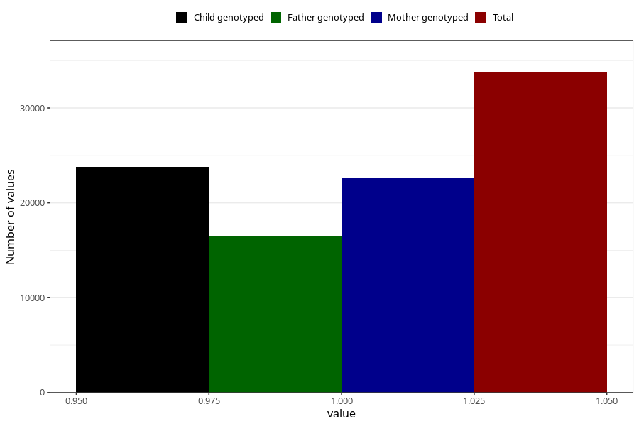

# contraception_used_pill
Variable mapping to questionnaire: q1m, question AA34.
- Number of values:

| Value | Total | Child genotyped | Mother genotyped | Father genotyped |
| ----- | ----- | --------------- | ---------------- | ---------------- |
| Missing | 79896 | 51621 | 49086 | 33798 |
| Non-missing | 33727 | 23810 | 22683 | 16420 |
| 1 | 33727 | 23810 | 22683 | 16420 |

