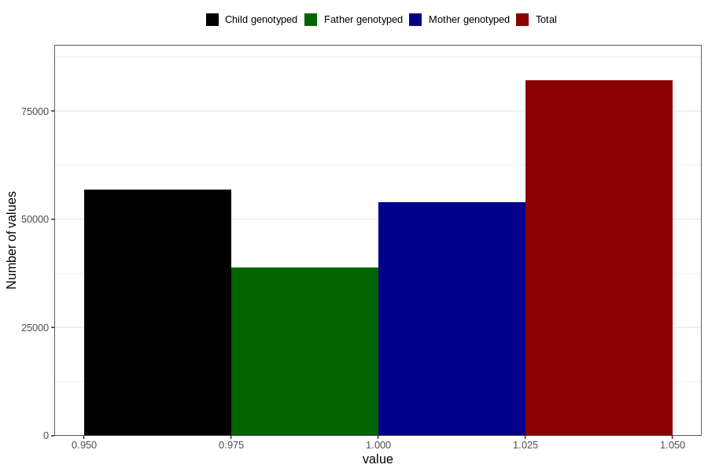

# lost_periods_no
Variable mapping to questionnaire: q1m, question AA17.
- Number of values:

| Value | Total | Child genotyped | Mother genotyped | Father genotyped |
| ----- | ----- | --------------- | ---------------- | ---------------- |
| Missing | 31583 | 18677 | 17770 | 11412 |
| Non-missing | 82040 | 56754 | 53999 | 38806 |
| 1 | 82040 | 56754 | 53999 | 38806 |

