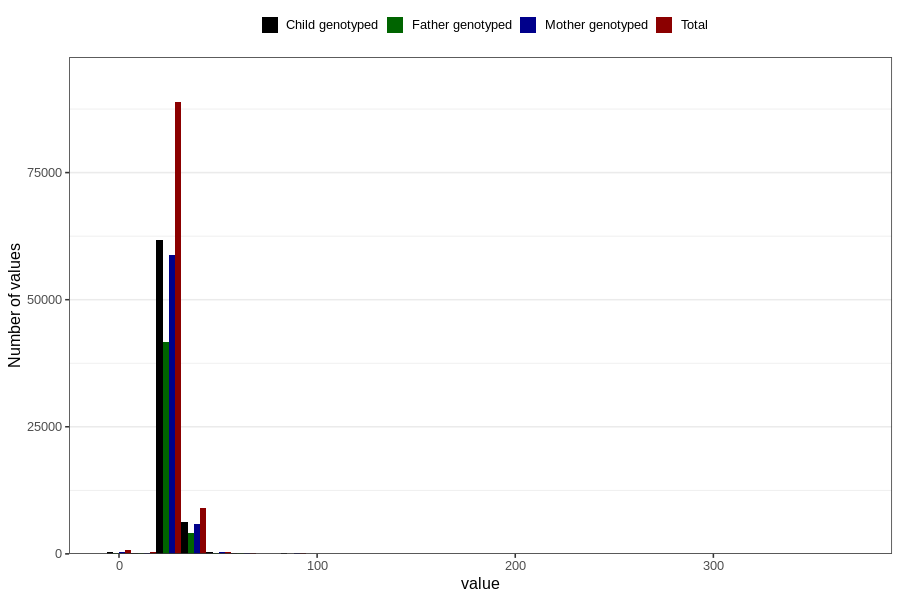

# menstrual_cycle_length
Variable mapping to questionnaire: q1m, question AA13.
- Number of values:

| Value | Total | Child genotyped | Mother genotyped | Father genotyped |
| ----- | ----- | --------------- | ---------------- | ---------------- |
| Missing | 13769 | 6151 | 5848 | 3672 |
| Non-missing | 99854 | 69280 | 65921 | 46546 |
| 25th percentile | 28 | 28 | 28 | 28 |
| 50th percentile | 28 | 28 | 28 | 28 |
| 75th percentile | 30 | 30 | 30 | 30 |

