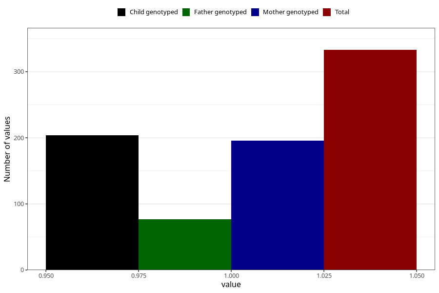

# treated_for_infertility_insemination
Variable mapping to questionnaire: q1m, question AA77.
- Number of values:

| Value | Total | Child genotyped | Mother genotyped | Father genotyped |
| ----- | ----- | --------------- | ---------------- | ---------------- |
| Missing | 113290 | 75227 | 71573 | 50141 |
| Non-missing | 333 | 204 | 196 | 77 |
| 1 | 333 | 204 | 196 | 77 |

