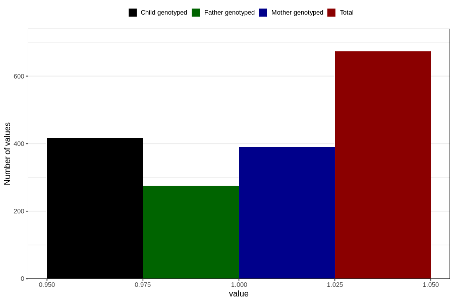

# treated_for_infertility_other
Variable mapping to questionnaire: q1m, question AA81.
- Number of values:

| Value | Total | Child genotyped | Mother genotyped | Father genotyped |
| ----- | ----- | --------------- | ---------------- | ---------------- |
| Missing | 112950 | 75014 | 71379 | 49943 |
| Non-missing | 673 | 417 | 390 | 275 |
| 1 | 673 | 417 | 390 | 275 |

