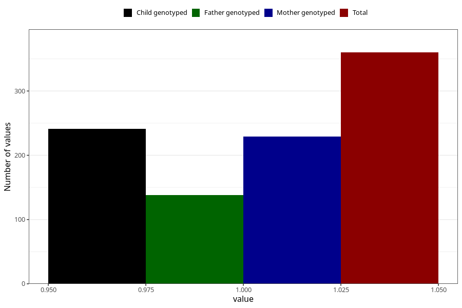

# treated_for_infertility_previous_fallopian_tube_suregery
Variable mapping to questionnaire: q1m, question AA68.
- Number of values:

| Value | Total | Child genotyped | Mother genotyped | Father genotyped |
| ----- | ----- | --------------- | ---------------- | ---------------- |
| Missing | 113263 | 75190 | 71540 | 50080 |
| Non-missing | 360 | 241 | 229 | 138 |
| 1 | 360 | 241 | 229 | 138 |

