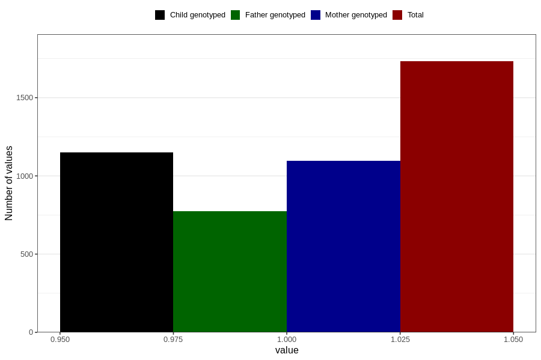

# treated_for_infertility_previous_test_tube
Variable mapping to questionnaire: q1m, question AA78.
- Number of values:

| Value | Total | Child genotyped | Mother genotyped | Father genotyped |
| ----- | ----- | --------------- | ---------------- | ---------------- |
| Missing | 111891 | 74280 | 70672 | 49443 |
| Non-missing | 1732 | 1151 | 1097 | 775 |
| 1 | 1732 | 1151 | 1097 | 775 |

