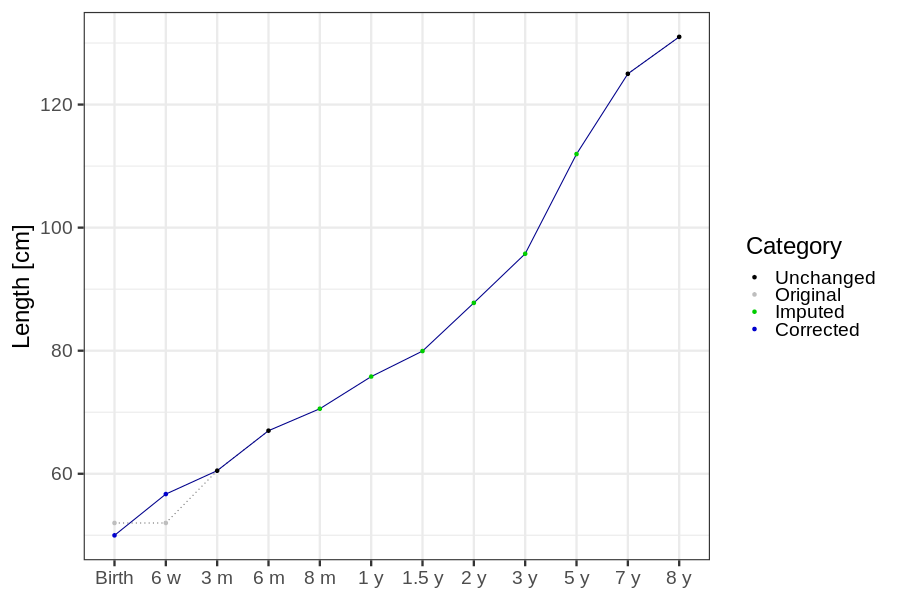
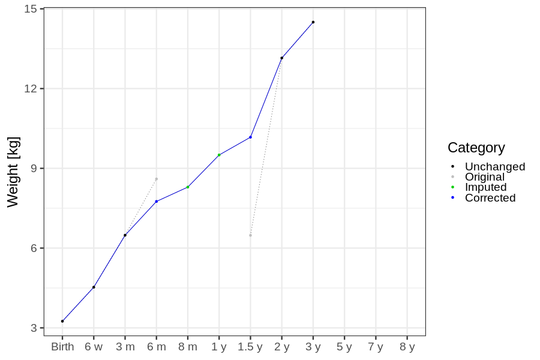

# Phenotypes
### Number of values

### Length vs weight

### Imputation
- Children with no data point altered: 68649
- Children with at least one data point altered: 44974
#### Random example: 70056
> imputed@length_16m imputed@length_2y imputed@weight_16m imputed@weight_2y

#### Random example: 66583
> imputed@length_16m imputed@length_2y imputed@weight_16m imputed@weight_2y

#### Random example: 2963
> imputed@length_16m imputed@length_2y imputed@weight_16m imputed@weight_2y

#### Random example: 17339
> imputed@length_16m imputed@length_2y imputed@weight_16m imputed@weight_2y

#### Random example: 48322
> imputed@length_16m imputed@length_2y imputed@weight_16m imputed@weight_2y

#### Random example: 79847
> imputed@length_16m imputed@length_2y imputed@weight_16m imputed@weight_2y

#### Random example: 97543
> imputed@length_16m imputed@length_2y imputed@weight_16m imputed@weight_2y

#### Random example: 46998
> imputed@length_16m imputed@length_2y imputed@weight_16m imputed@weight_2y

#### Random example: 8417
> imputed@length_16m imputed@length_2y imputed@weight_16m imputed@weight_2y

#### Random example: 2520
> imputed@length_16m imputed@length_2y imputed@weight_16m imputed@weight_2y

#### Random example: 70219
> imputed@length_16m imputed@length_2y imputed@weight_16m imputed@weight_2y

#### Random example: 14618
> imputed@length_16m imputed@length_2y imputed@weight_16m imputed@weight_2y

#### Random example: 67709
> imputed@length_16m imputed@length_2y imputed@weight_16m imputed@weight_2y

#### Random example: 76160
> imputed@length_16m imputed@length_2y imputed@weight_16m imputed@weight_2y

#### Random example: 11336
> imputed@length_16m imputed@length_2y imputed@weight_16m imputed@weight_2y

#### Random example: 94828
> imputed@length_16m imputed@length_2y imputed@weight_16m imputed@weight_2y

#### Random example: 46167
> imputed@length_16m imputed@length_2y imputed@weight_16m imputed@weight_2y

#### Random example: 55346
> imputed@length_16m imputed@length_2y imputed@weight_16m imputed@weight_2y

#### Random example: 37348
> imputed@length_16m imputed@length_2y imputed@weight_16m imputed@weight_2y

#### Random example: 14734
> imputed@length_16m imputed@length_2y imputed@weight_16m imputed@weight_2y

#### Most extreme example (1): 76262
> 

#### Most extreme example (2): 91582
> 

#### Most extreme example (3): 64802
> imputed@length_16m imputed@length_2y imputed@weight_16m imputed@weight_2y

#### Most extreme example (4): 72715
> imputed@length_16m imputed@length_2y imputed@weight_16m imputed@weight_2y

#### Most extreme example (5): 70358
> 

#### Most extreme example (6): 100789
> imputed@length_8m imputed@length_1y imputed@length_16m imputed@weight_8m imputed@weight_1y imputed@weight_16m

#### Most extreme example (7): 27614
> outlier@length_2y imputed@length_2y

#### Most extreme example (8): 16637
> 

#### Most extreme example (9): 89481
> 

#### Most extreme example (10): 100755
> imputed@length_5y imputed@weight_5y

#### Most extreme example (11): 79499
> 

#### Most extreme example (12): 54668
> imputed@weight_6m imputed@weight_8m imputed@weight_16m

#### Most extreme example (13): 64729
> imputed@length_16m imputed@length_2y imputed@weight_16m imputed@weight_2y

#### Most extreme example (14): 30704
> 

#### Most extreme example (15): 31381
> 

#### Most extreme example (16): 51548
> outlier@weight_1y imputed@weight_1y imputed@weight_2y

#### Most extreme example (17): 44042
> 

#### Most extreme example (18): 3815
> 

#### Most extreme example (19): 19023
> imputed@length_16m imputed@length_2y imputed@weight_16m imputed@weight_2y

#### Most extreme example (20): 74756
> 

