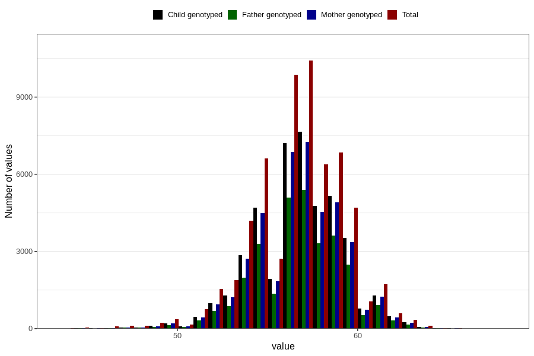

# length_6w
Variable mapping to questionnaire: q4, question DD213.
- Number of values:

| Value | Total | Child genotyped | Mother genotyped | Father genotyped |
| ----- | ----- | --------------- | ---------------- | ---------------- |
| Missing | 52676 | 31420 | 29924 | 19403 |
| Non-missing | 60947 | 44011 | 41845 | 30815 |
| 25th percentile | 55 | 55.5 | 55.4 | 55.5 |
| 50th percentile | 57 | 57 | 57 | 57 |
| 75th percentile | 58.5 | 58.5 | 58.5 | 58.5 |

