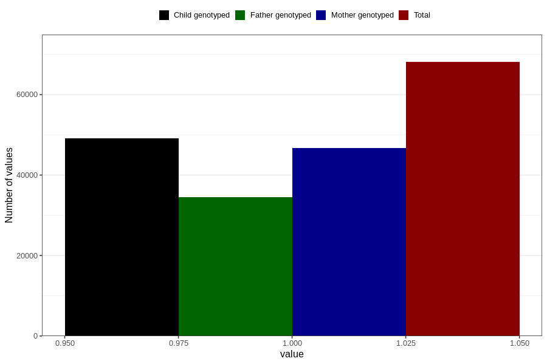

# abnormal_head_circumference_no_18m
Variable mapping to questionnaire: q5, question EE811.
- Number of values:

| Value | Total | Child genotyped | Mother genotyped | Father genotyped |
| ----- | ----- | --------------- | ---------------- | ---------------- |
| Missing | 45538 | 26315 | 25113 | 15784 |
| Non-missing | 68085 | 49116 | 46656 | 34434 |
| 1 | 68085 | 49116 | 46656 | 34434 |

