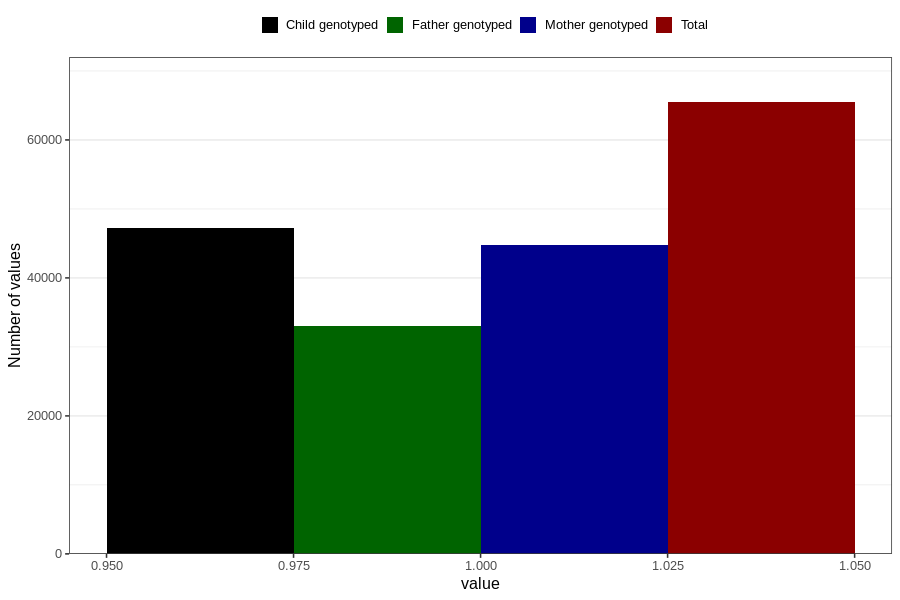

# asthma_no_18m
Variable mapping to questionnaire: q5, question EE823.
- Number of values:

| Value | Total | Child genotyped | Mother genotyped | Father genotyped |
| ----- | ----- | --------------- | ---------------- | ---------------- |
| Missing | 48165 | 28258 | 26952 | 17172 |
| Non-missing | 65458 | 47173 | 44817 | 33046 |
| 1 | 65458 | 47173 | 44817 | 33046 |

