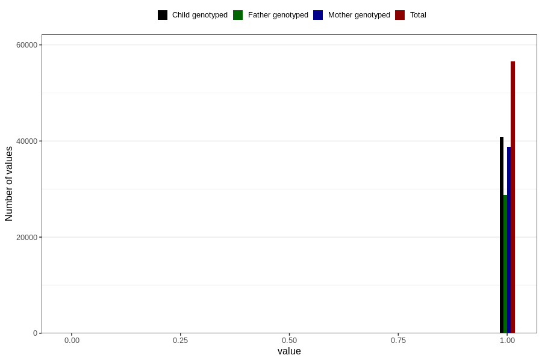

# autistic_traits_2_no_3y
Variable mapping to questionnaire: q6, question GG582.
- Number of values:

| Value | Total | Child genotyped | Mother genotyped | Father genotyped |
| ----- | ----- | --------------- | ---------------- | ---------------- |
| Missing | 57063 | 34578 | 32973 | 21454 |
| Non-missing | 56560 | 40853 | 38796 | 28764 |
| 0 | 28 | 17 | 16 | 8 |
| 1 | 56532 | 40836 | 38780 | 28756 |

