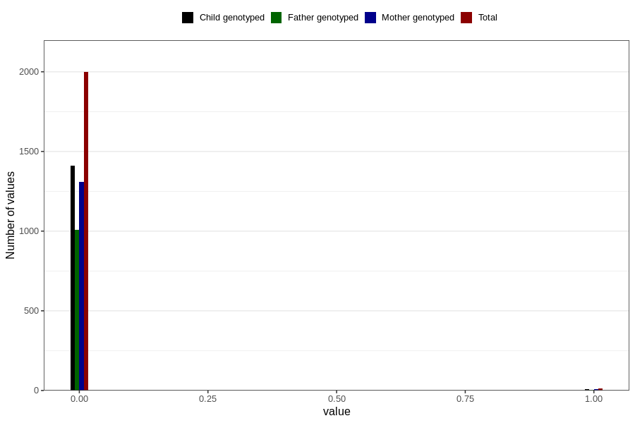

# autistic_traits_2_previous_3y
Variable mapping to questionnaire: q6, question GG584.
- Number of values:

| Value | Total | Child genotyped | Mother genotyped | Father genotyped |
| ----- | ----- | --------------- | ---------------- | ---------------- |
| Missing | 111612 | 74011 | 70454 | 49203 |
| Non-missing | 2011 | 1420 | 1315 | 1015 |
| 0 | 1998 | 1410 | 1307 | 1009 |
| 1 | 13 | 10 | 8 | 6 |

