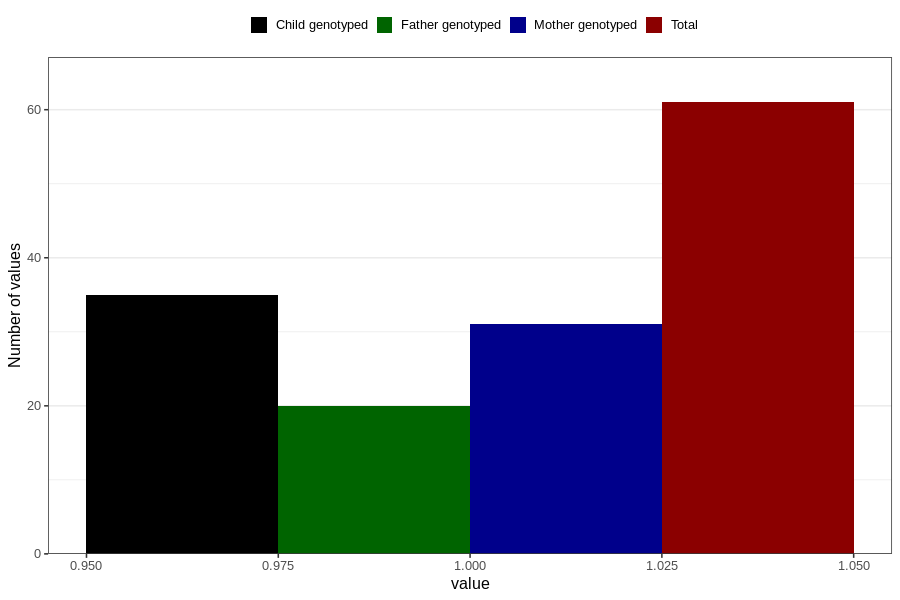

# behavioural_problems_yes_18m
Variable mapping to questionnaire: q5, question EE848.
- Number of values:

| Value | Total | Child genotyped | Mother genotyped | Father genotyped |
| ----- | ----- | --------------- | ---------------- | ---------------- |
| Missing | 113562 | 75396 | 71738 | 50198 |
| Non-missing | 61 | 35 | 31 | 20 |
| 1 | 61 | 35 | 31 | 20 |

