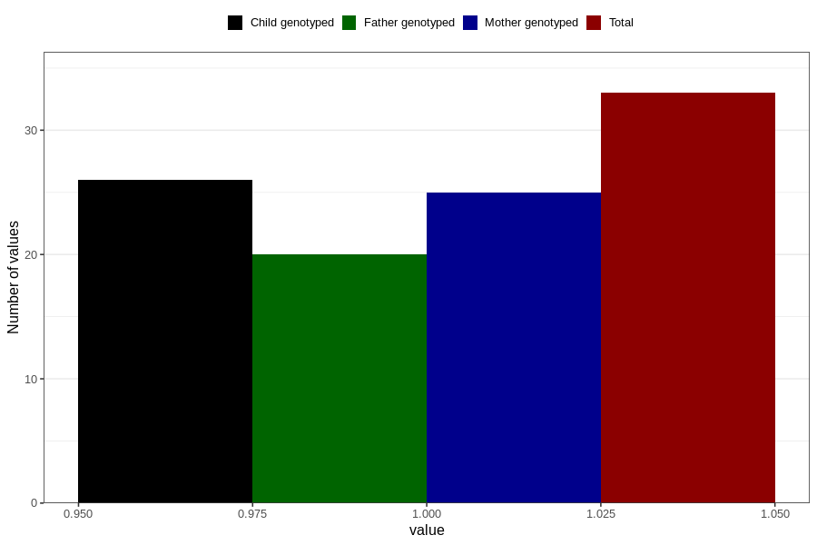

# diabetes_yes_3y
Variable mapping to questionnaire: q6, question GG50.
- Number of values:

| Value | Total | Child genotyped | Mother genotyped | Father genotyped |
| ----- | ----- | --------------- | ---------------- | ---------------- |
| Missing | 113590 | 75405 | 71744 | 50198 |
| Non-missing | 33 | 26 | 25 | 20 |
| 1 | 33 | 26 | 25 | 20 |

