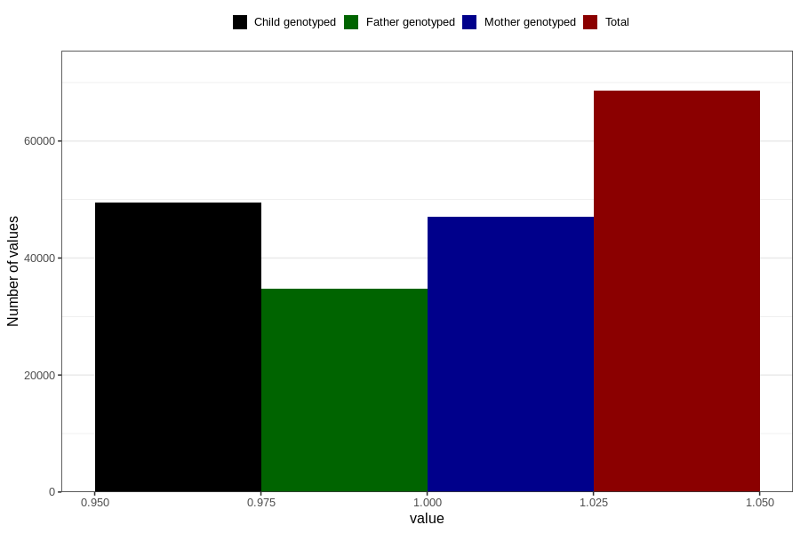

# heart_defect_no_18m
Variable mapping to questionnaire: q5, question EE815.
- Number of values:

| Value | Total | Child genotyped | Mother genotyped | Father genotyped |
| ----- | ----- | --------------- | ---------------- | ---------------- |
| Missing | 45044 | 25935 | 24728 | 15496 |
| Non-missing | 68579 | 49496 | 47041 | 34722 |
| 1 | 68579 | 49496 | 47041 | 34722 |

